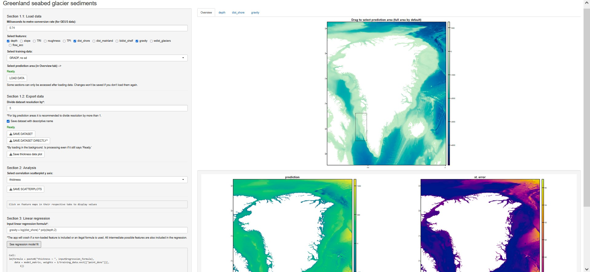

# Greenland glacier sediment thickness

Project started under internship at the department of Geoscience, Aarhus University, with collaboration from the Geological Survey of Denmark and Greenland research institute.

This app pulls pre-processed (by me) geospatial data from a local database and visualizes it using ShinyApp integration to build an interactive HTML webpage, allowing you to see, modify and export the data in real time.

Removed all datasets except app-crucial GEBCO depth and GRADP thickness because of data confidentiality and excessive size. Restrictions caused:
- Can only select "depth" feature.
- Can only select "GRADP, no sd" in training data dropdown.

## Instructions to run

Windows: 

	Either execute "run.bat", which opens the app automatically, or follow the Linux steps.

Linux:

	1. Install R or use the portable version of R already installed as "Application/R/bin/R.exe".
	2. Open "Application/app/app.R" and execute getwd() to make sure the working directory is ".../Application/app". If not, set the correct directory by using setwd(".../Application/app/") or open "Application/app/Environment.Rproj" before "app.R".
	3. Install the necessary packages by uncommenting and running the 2nd line of code in "app.R" if not already installed.
	4. Run app by executing the last line of code, "shinyApp(ui = ui, server = server)", or with the dedicated button at the top of Rstudio.

MAC OS:

	1. Install R.
	2. Open "Application/app/app.R" and execute getwd() to make sure the working directory is ".../Application/app". If not, set the correct directory by using setwd(".../Application/app/") or open "Application/app/Environment.Rproj" before "app.R".
	3. Install the necessary packages by uncommenting and running the 2nd line of code in "app.R" if not already installed.
	4. Run app by executing the last line of code, "shinyApp(ui = ui, server = server)", or with the dedicated button at the top of Rstudio.
